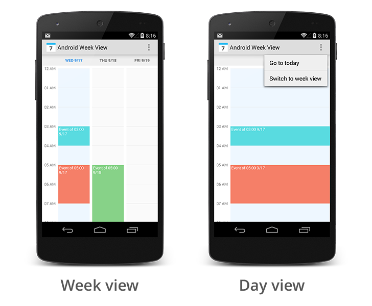

Android Week View
=================

**Android Week View** is an Android library to display calendar views within an app. It was developed by [Raquib-ul Alam](https://github.com/alamkanak). Because it is not currently maintained and does not work when using API level 28, I’m providing this fork.

Usage
---------
1. Add JitPack repository to your build file.
```groovy
allprojects {
 repositories {
 ...
 maven { url 'https://jitpack.io' }
 }
}
```

2. Add the dependency.
```groovy
// For the bugfix-only version
implementation 'com.github.thellmund:Android-Week-View:1.3'

// For the version with an updated API
implementation 'com.github.thellmund:Android-Week-View:2.0'
```
More info about version 2.0 here: [Release 2.0](https://github.com/thellmund/Android-Week-View/releases/tag/2.0)

Below, you find the original README by [Raquib-ul Alam](https://github.com/alamkanak).

---

Android Week View
=================



Features
------------

* Week view calendar
* Day view calendar
* Custom styling
* Horizontal and vertical scrolling
* Infinite horizontal scrolling
* Live preview of custom styling in xml preview window

Who uses it
---------------

* [Series Addict](https://play.google.com/store/apps/details?id=com.alamkanak.seriesaddict)
* Using the library? Just [tweet me](https://twitter.com/alamkanak) or [send me an email](mailto:alam.kanak@gmail.com).

Usage
---------

1. Import the library into your project.
  * Grab via maven
  
    ```xml
    <dependency>
      <groupId>com.github.alamkanak</groupId>
      <artifactId>android-week-view</artifactId>
      <version>1.2.6</version>
      <type>aar</type>
    </dependency>
    ```
  * Grab via gradle
  
    ```groovy
    compile 'com.github.alamkanak:android-week-view:1.2.6'
    ```
2. Add WeekView in your xml layout.

    ```xml
    <com.alamkanak.weekview.ui.WeekView
            android:id="@+id/weekView"
            android:layout_width="match_parent"
            android:layout_height="match_parent"
            app:eventTextColor="@android:color/white"
            app:textSize="12sp"
            app:hourHeight="60dp"
            app:headerColumnPadding="8dp"
            app:headerColumnTextColor="#8f000000"
            app:headerRowPadding="12dp"
            app:columnGap="8dp"
            app:noOfVisibleDays="3"
            app:headerRowBackgroundColor="#ffefefef"
            app:dayBackgroundColor="#05000000"
            app:todayBackgroundColor="#1848adff"
            app:headerColumnBackground="#ffffffff"/>
    ```
3. Write the following code in your java file.

    ```java
    // Get a reference for the week view in the layout.
    mWeekView = (WeekView) findViewById(R.id.weekView);

    // Set an action when any event is clicked.
    mWeekView.setOnEventClickListener(mEventClickListener);

    // The week view has infinite scrolling horizontally. We have to provide the events of a
    // month every time the month changes on the week view.
    mWeekView.setMonthChangeListener(mMonthChangeListener);

    // Set long press listener for events.
    mWeekView.setEventLongPressListener(mEventLongPressListener);
    ```
4. Implement `WeekView.MonthChangeListener`, `WeekView.EventClickListener`, `WeekView.EventLongPressListener` according to your need.

5. Provide the events for the `WeekView` in `WeekView.MonthChangeListener.onMonthChange()` callback. Please remember that the calendar pre-loads events of three consecutive months to enable lag-free scrolling.

    ```java
    MonthLoader.MonthChangeListener mMonthChangeListener = new MonthLoader.MonthChangeListener() {
        @Override
        public List<WeekViewEvent> onMonthChange(int newYear, int newMonth) {
            // Populate the week view with some events.
            List<WeekViewEvent> events = getEvents(newYear, newMonth);
            return events;
        }
    };
    ```

Customization
-------------------

You can customize the look of the `WeekView` in xml. Use the following attributes in xml. All these attributes also have getters and setters to enable you to change the style dynamically.

- `allDayEventHeight`
- `columnGap`
- `dayBackgroundColor`
- `dayNameLength`
- `eventMarginVertical`
- `eventPadding`
- `eventTextColor`
- `eventTextSize`
- `firstDayOfWeek`
- `headerColumnBackground`
- `headerColumnPadding`
- `headerColumnTextColor`
- `headerRowBackgroundColor`
- `headerRowPadding`
- `hourHeight`
- `hourSeparatorColor`
- `hourSeparatorHeight`
- `noOfVisibleDays`
- `overlappingEventGap`
- `textSize`
- `todayBackgroundColor`
- `todayHeaderTextColor`
- `showDistinctPastFutureColor`
- `futureBackgroundColor`
- `pastBackgroundColor`
- `showDistinctWeekendColor`
- `futureWeekendBackgroundColor`
- `pastWeekendBackgroundColor`
- `showNowLine`
- `nowLineColor`
- `nowLineThickness`
- `scrollDuration`

Interfaces
----------

Use the following interfaces according to your need.

- `mWeekView.setWeekViewLoader()` to provide events to the calendar
- `mWeekView.setMonthChangeListener()` to provide events to the calendar by months
- `mWeekView.setOnEventClickListener()` to get a callback when an event is clicked
- `mWeekView.setEventLongPressListener()` to get a callback when an event is long pressed
- `mWeekView.setEmptyViewClickListener()` to get a callback when any empty space is clicked
- `mWeekView.setEmptyViewLongPressListener()` to get a callback when any empty space is long pressed
- `mWeekView.setDateTimeInterpreter()` to set your own labels for the calendar header row and header column
- `mWeekView.setScrollListener()` to get an event every time the first visible day has changed

Sample
----------

There is also a [sample app](https://github.com/alamkanak/Android-Week-View/tree/master/sample) to get you started.

To do
-------

* Add event touch feedback selector
* Show events that expand multiple days properly

Changelog
---------

**Version 1.2.6**

* Add empty view click listener
* Fix padding bug
* Fix bug when setting colors of different components
* Add ability to turn off fling gesture
* Add example of how to load events asynchronously in the sample app

**Version 1.2.5**

* Add support for using subclasses of `WeekViewEvent`
* Fix scroll animation
* Add support for semi-transparent header colors

**Version 1.2.4**

* **NOTE:** If you are using `WeekView.MonthChangeListener`, make sure to change it into `MonthLoader.MonthChangeListener`
* Add support to have loaders other than MonthViewLoader
* Add pinch to zoom support
* Add support for location
* Add ability to have different colors for past, future, weekend days
* Add support for "now" line

**Version 1.2.3**

* Get callbacks when scrolling horizontally
* `goToHour` and `goToDate` methods has been fixed
* Use `getFirstVisibleHour` method to get the first visible hour in the week view

**Version 1.2.1**

* Better scrolling added
* Get callbacks when empty view is tapped/long pressed
* Control the speed of scrolling
* Support for multiple language added
* Ability to set your own interpreter for header row and column added

**Version 1.1.7**

* You can now dynamically scroll to an hour of your preference.

**Version 1.1.6**

* Added support for events that expands to multiple days

**Version 1.1.5**

* A bug related to overlapping events fixed
* You can now programmatically get first and last visible day in the week view

**Version 1.1.4**

* Small bug fixed

**Version 1.1.3**

* Margins support added for overlapping events

**Version 1.1.2**

* Small bugs fixed
* Hour separator inconsistency fixed

**Version 1.1.1**

* Overlapping event bug fixed

**Version 1.1.0**

* Added support for overlapping events

License
----------

    Copyright 2014 Raquib-ul-Alam

    Licensed under the Apache License, Version 2.0 (the "License");
    you may not use this file except in compliance with the License.
    You may obtain a copy of the License at

       http://www.apache.org/licenses/LICENSE-2.0

    Unless required by applicable law or agreed to in writing, software
    distributed under the License is distributed on an "AS IS" BASIS,
    WITHOUT WARRANTIES OR CONDITIONS OF ANY KIND, either express or implied.
    See the License for the specific language governing permissions and
    limitations under the License.
