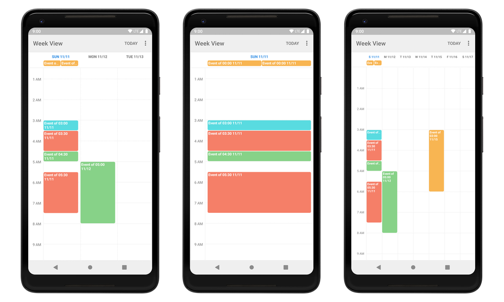

Android Week View
=================

**Android Week View** is an Android library for displaying calendar views within an app. It was initially developed by [Raquib-ul Alam](https://github.com/alamkanak), but is not currently maintained and does not work when using API level 28. Therefore, I’m providing this fork. 



Features
---------
* Display single-day or multi-day calendar views in your app
* Extensive styling customization possible
* Infinite horizontal scrolling
* Interactive via event click listeners
* Interoperable with Kotlin

Usage
---------
1. Add the JitPack repository to your project-level build file and the dependency to the app-level build file.
```groovy
// build.gradle (project-level)
allprojects {
 repositories {
  ...
  maven { url 'https://jitpack.io' }
 }
}

// build.gradle (app-level)
implementation 'com.github.thellmund:Android-Week-View:3.3'
```

2. Add `WeekView` in your XML layout.
```xml
<com.alamkanak.weekview.WeekView
    android:id="@+id/weekView"
    android:layout_width="match_parent"
    android:layout_height="match_parent"
    app:eventTextColor="@color/white"
    app:timeColumnTextSize="12sp"
    app:hourHeight="60dp"
    app:timeColumnPadding="8dp"
    app:timeColumnTextColor="@color/light_blue"
    app:timeColumnBackgroundColor="@color/white"
    app:headerRowPadding="12dp"
    app:columnGap="8dp"
    app:numberOfVisibleDays="3"
    app:headerRowBackgroundColor="@color/light_gray"
    app:dayBackgroundColor="@color/white"
    app:todayBackgroundColor="@color/light_blue"/>
```

3. Prepare the class of objects that you want to display in `WeekView` by implementing `WeekViewDisplayable<T>`.
```java
public class CalendarItem implements WeekViewDisplayable<CalendarItem> {

    private long id;
    private String title;
    private DateTime startTime;
    private DateTime endTime;
    private String location;
    private int color;
    
    /* ... */
    
    @Override
    public WeekViewEvent<CalendarItem> toWeekViewEvent() {
        // Note: It's important to pass "this" as the last argument to WeekViewEvent's constructor.
        // This way, the EventClickListener can return this object in its onEventClick() method.
        boolean isAllDay = DateUtils.isAllDay(startTime, endTime);
        return new WeekViewEvent<>(
            id, title, startTime.toGregorianCalendar(), 
            endTime.toGregorianCalendar(), location, color, isAllDay, this
        );
    }

}
```

4. Configure `WeekView` in code.
```java
WeekView<CalendarItem> weekView = (WeekView) findViewById(R.id.weekView);
weekView.setOnEventClickListener(new EventClickListener<CalendarItem>() {
    @Override
    public void onEventClick(CalendarItem event, RectF eventRect) {
        // Do something with the CalendarItem
    }
});

// WeekView has infinite horizontal scrolling. Therefore, you need to provide the events 
// of a month whenever that the currently displayed month changes.
weekView.setMonthChangeListener(new MonthLoader.MonthChangeListener<CalendarItem>() {
    @Override
    public List<WeekViewDisplayable<CalendarItem>> onMonthChange(Calendar startDate, Calendar endDate) {
        return mDatabase.getCalendarItemsInRange(startDate, endDate);
    }
});
```

--- 

Check out the [wiki](https://github.com/thellmund/Android-Week-View/wiki) for more information about customization options, available listeners and public methods.

Take a look at the [sample app](https://github.com/thellmund/Android-Week-View/tree/develop/sample) for more details on how to use `WeekView`.

See the [changelog](https://github.com/thellmund/Android-Week-View/blob/develop/CHANGELOG.md) for new functionality and updates to the API.

---

You can find the [original README](https://github.com/alamkanak/Android-Week-View) here.

License
----------

    Copyright 2014 Raquib-ul-Alam

    Licensed under the Apache License, Version 2.0 (the "License");
    you may not use this file except in compliance with the License.
    You may obtain a copy of the License at

       http://www.apache.org/licenses/LICENSE-2.0

    Unless required by applicable law or agreed to in writing, software
    distributed under the License is distributed on an "AS IS" BASIS,
    WITHOUT WARRANTIES OR CONDITIONS OF ANY KIND, either express or implied.
    See the License for the specific language governing permissions and
    limitations under the License.
